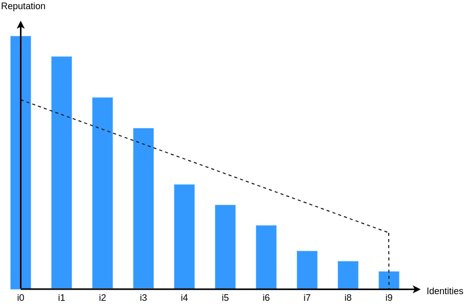
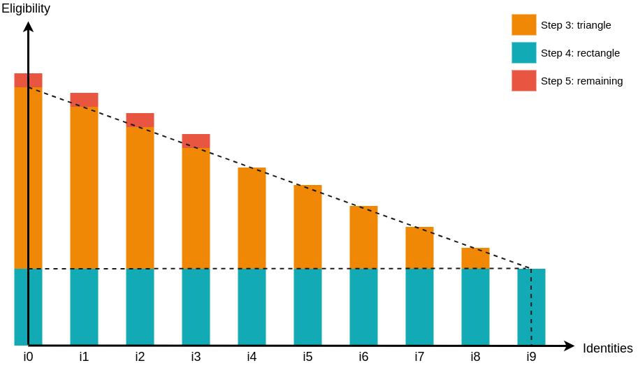

<pre>
    WIP: mariocao-min-difficulty-dr
    Layer: Consensus (hard fork)
    Title: Set minimum data request mining difficulty
    Authors: Mario Cao <mario@witnet.foundation>
    Discussions-To: `#dev-general` channel on Witnet Community's Discord server
    Status: Draft
    Type: Standards Track
    Created: 2021-06-08
    License: BSD-2-Clause
</pre>


## Abstract

This proposal introduces a lower bound on data request mining difficulty in case that the Active Reputation Set (ARS) goes to abnormally low sizes to avoid 2 undesirable scenarios:

1. if ARS size is slightly bigger than the data request replication factor, mining is mostly taken over by a few identities therein, and
2. if ARS is empty or almost empty, most identities (even those out of the ARS) are eligible to mine data requests as their probability will tend to 100%.

The second scenario should be avoided at all costs as it may endanger the network stability or, even, pose an availability threat in terms of a [denial-of-service attack][DoS].


## Motivation and rationale

The Witnet protocol contains a series of rules that enable nodes to compute their own eligibility for discovering if they participate in a data request. If eligible, witnessing nodes may send commit and reveal transactions with the data retrieval and aggregation results.

Data request eligibilities are also computed by validating nodes to check if those identities were part of the randomly selected data request committee.

Data request eligibility is computed by using the Reputation-based Proof of Eligibility (_[RepPoE]_) algorithm. It determines if an identity is eligible or not based on reputation metrics and the data request replication factor.

Due to the stochastic nature of the algorithm and because not all eligible committee members might be available for a given data request, the _RepPoE_ algorithm includes a backup factor to increase the odds of having enough candidate witnesses for constituting the committee. Therefore, depending on how this algorithm is fine-tuned, the number of eligible identities will vary, and, consequently, the number of commit transactions broadcasted to the network.

Analogously to the [WIP-0012], it becomes clear that an upper bound must be enforced on data request eligibility, which translates to enforcing a lower bound on data request mining difficulty. This will prevent potential floodings of `commit` which may lead to an accidental [denial-of-service attack][DoS].


### Current implementation of Reputation-based Proof of Eligibility (_RepPoE_)

A simplified version of the reputation-based proof of eligibility algorithm (a.k.a. _RepPoE_) could be defined as:

```
P_i = reputation_i / R * rf
```

where:

- `P` is the probability of an identity being eligible
- `reputation_i` is the reputation
- `R` is the total active reputation in the system
- `rf` is the data request replication factor
- `alpha` is a factor as defined in [Dynamic Threshold]

The probability `P` will be used as a static threshold that sets the maximum value until which a _RepPoE_ proof can be considered valid. This threshold will be compared with the output of a [VRF] of the identity which takes as seed the data request hash and the last checkpoint beacon of the chain (i.e. epoch and block hash).

Later, a factor `alpha` was introduced to adjust the data request mining eligibilities by taking into consideration the state of the reputation system. This factor aims to compensate for the over-representation of identities with significant reputation scores and thus affecting the average amount of eligible identities per data request.

```
P_i = reputation_i / R * rf * alpha
```

where:

- `alpha` is a factor as defined in [Dynamic Threshold]

The last modification to the _RepPoE_ algorithm was the usage of a metric labeled as _identity eligibility_ instead of the reputation score as the numerator of the previous formula:

```
P_i = eligibility_i / R * rf * alpha
```

where:

- `eligibility_i` is the computed identity eligibility as mentioned in [witnet-rust#1496] and later described

The _eligibility_ metric aims to achieve a "more linear" distribution of data request mining probabilities across identities. As shown in the images below, the eligibility can be understood as a redistribution of reputation across identities following a _right trapezoid_ shape.



Fig. 1 - Identities sorted by reputation in descending order.

<br/>



Fig. 2 - Application of the <i>eligibility algorithm</i> in previous sorted identities.

<br/>

The _eligibility_ algorithm can be decomposed into 5 simple steps:

1. Identities are sorted by reputation in descending order (see Fig.1).

2. The upper edge of the trapezoid (the triangle) is calculated from the line following the equation `y = m*x + k`, where:

    ```rust
    let k = 1.5 * (average_reputation - minimum_reputation);
    let m = -k / (active_reputed_identities_length - 1);
    ```

3. The curve is used to assign the initial eligibility to the previously sorted identities (see _Step 3: triangle_ in Fig.2).

4. The identities eligibility is offset by adding the remaining reputation points that were not redistributed in the previous step (see _Step 4: rectangle_ in Fig.2).

    ```rust
    let remaining_reputation = total_active_reputation - total_triangle_reputation;
    let offset_reputation = remaining_reputation / (active_reputed_identities_length);
    ```

    This step is important to keep the same data request mining difficulty for newcomers or Sybil identities.

5. The rest of the `offset_reputation` integer division is assigned (in order) to the sorted identities until depleted (see _Step 5: remaining_ in Fig.2).

    ```rust
    let identities_with_extra_eligibility = (remaining_reputation) % active_reputed_identities_length;
    ```

Steps 4 and 5 aim to preserve the sum of reputation equal to the sum of eligibility. Geometrically, this can be defined as matching the area of the trapezoid (Fig.2) with the area of the reputation curve (Fig.1).

The identity's reputation, from the perspective of chain state, is not altered after applying the [RepPoE] algorithm.


## Specification


### Removal of the dynamic threshold

**(1)**: The [Dynamic Threshold] factor MUST be removed from the _RepPoE_ algorithm.

As eligibility across reputed identities is fairer due to the changes described in [witnet-rust#1496], the [Dynamic Threshold] does not have anymore a significant impact on the probability of mining data requests. Additionally, the [Dynamic Threshold] was not properly updated to use the eligibility metrics instead of the reputation scores.

In case of abnormally low ARS sizes, it is assumed that there are in the order of thousands of non-reputed identities computing their eligibility to be selected to solved the data request. This assumption is in line with the minimum difficulty set in [WIP-0012] and previous network conditions documented in [WIP-0009].


### Introduction of a minimum data request mining difficulty

**(2)**: A lower bound on data request mining difficulty is proposed. For all data requests following the activation of this proposal, eligibility MUST be computed using the greater of two values: the ARS size and a constant `minimum_difficulty`:

```rust
let dr_eligibity = identity_eligibility / max(total_active_reputation, minimum_difficulty) * replication_factor
```


### Equate the data request minimum difficulty to the mining difficulty

Analogously to [WIP-0012], such lower bound to be effective, its value needs to be strictly greater than `replication_factor`, as otherwise, ARS members will have an eligibility equal or greater than 100%.

In [WIP-0012], the `initial_difficulty` consensus constant was repurposed as `minimum_difficulty` for mining blocks.

**(3)**: A value of 2000 (two thousand) is set for the data request minimum difficulty so that it equals the `minimum_difficulty` defined in [WIP-0012].


## Backwards compatibility

- Implementer: a client that implements or adopts the protocol improvements proposed in this document.
- Non-implementer: a client that fails to or refuses to implement the protocol improvements proposed in this document.


#### Consensus cheat sheet

Upon entry into force of the proposed improvements:

- Block and transactions that were considered valid by former versions of the protocol MUST continue to be considered valid.
- Blocks and transactions produced by non-implementers MUST be validated by implementers using the same rules as with those coming from implementers, that is, the new rules.
- Implementers MUST apply the proposed logic when evaluating transactions or computing their own data request eligibility.

As a result:

- Non-implementers MAY NOT get their blocks and transactions accepted by implementers.
- Implementers MAY NOT get their valid blocks accepted by non-implementers.
- Non-implementers MAY consolidate blocks and superblocks than implementers.

Due to this last point, this MUST be considered a consensus-critical protocol improvement. An adoption plan MUST be proposed, setting an activation date that gives miners enough time in advance to upgrade their existing clients.


### Libraries, clients, and interfaces

The protocol improvements proposed herein will affect any library or client implementing the core Witnet block chain protocol, especially the commit transaction validation rules and the algorithm for computing data request mining difficulty and eligibility.

Libraries, clients, interfaces, APIs, or any other software or hardware that do not implement or apply block candidate prioritization or the algorithm for computing mining difficulty and eligibility will remain unaffected.


## Reference Implementation

A reference implementation for the proposed protocol improvements labeled as  **(2)** and **(3)** can be found in the [`202106-recovery` branch][3rd-hf] in the witnet-rust repository.

The proposed protocol improvement labeled as **(1)** only requires that the factor used for the eligibility is equal to the number of witnesses required by the data request (line #2111 in `witnet-rust/validations/src/validations.rs` from [`202106-recovery` branch][3rd-hf]).

```rust
let factor = num_witnesses;
```


## Adoption Plan

An activation date needs to be further discussed in the case that the proposal is accepted by the community.


## Acknowledgements

This proposal has been cooperatively discussed and devised by many individuals from the Witnet development community.

Special thanks to [Luis Rubio][lrubiorod] for double-checking the specification of this proposal and to [Tomasz Polaczyk][tmpolaczyk] for contributing to the reference implementation in Rust.


[DoS]: https://en.wikipedia.org/wiki/Denial-of-service_attack
[Dynamic Threshold]: https://github.com/witnet/research/blob/master/reputation/docs/dynamic-threshold.md
[RepPoE]: #current-implementation-of-reputation-based-proof-of-eligibility-reppoe
[VRF]:  https://medium.com/witnet/c847edf123f7
[WIP-0009]: /wip-0009.md
[WIP-0012]: /wip-0012.md
[3rd-hf]: https://github.com/witnet/witnet-rust/tree/202106-recovery
[lrubiorod]: https://github.com/lrubiorod
[tmpolaczyk]: https://github.com/tmpolaczyk
[witnet-rust#1496]: https://github.com/witnet/witnet-rust/issues/1496
